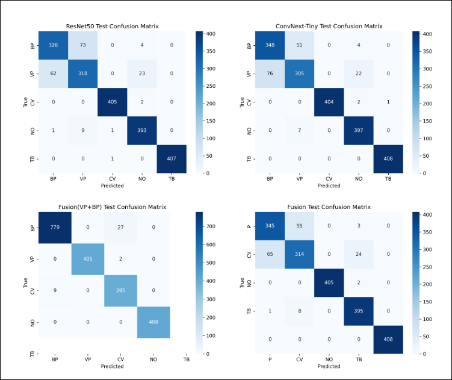

# Chest X-ray Disease Classification using Deep Learning

A comprehensive deep learning framework for multi-class chest X-ray classification using classical ML models, deep CNN architectures, transfer learning, and ensemble fusion techniques.

---

## Overview

This project investigates automated lung disease classification from chest X-ray images using multiple machine learning and deep learning approaches. It includes full pipeline development from preprocessing to advanced ensemble fusion.

Key contributions:
- Classical ML vs Deep Learning comparison
- Multiple CNN architectures (from scratch + pretrained)
- Advanced training strategies (MixUp, EMA, label smoothing)
- Transfer learning with ResNet and ConvNeXt
- Validation-informed ensemble fusion
- Binary clinical grouping (Pneumonia merging)

---

## Classes

- Bacterial Pneumonia (BP)  
- Viral Pneumonia (VP)  
- COVID-19 (CV)  
- Normal (NO)  
- Tuberculosis (TB)  

---

## Pipeline

### 1. Preprocessing
- Image resizing with aspect ratio preservation
- CLAHE-based contrast enhancement
- Noise reduction and normalization

### 2. Data Augmentation
- Random rotation
- Color jitter
- Random resized cropping

### 3. Models
- Decision Tree (baseline ML)
- SVM
- FFNN
- Simple CNN
- VGG16
- ResNet18
- ResNet50
- ConvNeXt-Tiny

### 4. Advanced Training Techniques
- MixUp augmentation
- Label smoothing
- Exponential Moving Average (EMA)
- Cosine annealing scheduler
- Gradient clipping

### 5. Ensemble Learning
- Validation-informed weighted soft fusion
- Multi-model probability aggregation
- Class-wise adaptive weighting

---

## Experimental Results

### Table 1: Model Comparison

| Model         | Accuracy (%) | Macro-F1 (%) |
|--------------|-------------|--------------|
| Decision Tree | 66.22 | 66.40 |
| SVM | 87.51 | 87.34 |
| FFNN | 86.47 | 86.28 |
| Simple CNN | 88.10 | 88.05 |
| VGG16 | 88.84 | 88.55 |
| ResNet18 | 89.88 | 89.78 |
| ResNet50 | 91.31 | 91.21 |
| ConvNeXt-Tiny | 91.95 | 91.81 |
| **Fusion Model** | **92.20** | **92.08** |

---

### Table 2: Class-wise Performance (Best Models)

| Model | BP | VP | CV | NO | TB |
|------|----|----|----|----|----|
| ResNet50 | 82.32 | 99.01 | 94.90 | 99.88 | 99.88 |
| ConvNeXt-Tiny | 84.16 | 79.63 | 95.63 | 92.91 | 97.42 |
| Fusion | 84.77 | 99.63 | 95.78 | 99.75 | 100.00 |

---

### Table 3: Binary Fusion (BP + VP → Pneumonia)

| Model | Accuracy (%) | Macro-F1 (%) |
|------|-------------|--------------|
| Fusion | 98.12 | 98.23 |

---

## Confusion Matrices

The following confusion matrices represent model performance on the test set:

- ResNet50
- ConvNeXt-Tiny
- Fusion (Pneumonia-aware)
- Final Ensemble Fusion

<p align="center">
  
</p>

---

## Key Findings

- ConvNeXt-Tiny and ResNet50 outperform classical ML models significantly
- Ensemble fusion improves stability and overall accuracy
- Class-wise weighting improves performance on minority classes
- Merging BP + VP improves pneumonia detection performance significantly

---

## Installation

```bash
pip install -r requirements.txt

---

##  Usage

```bash
# Preprocessing
python src/preprocess_images.py

# Augmentation
python src/augment_images.py

# CNN training
python src/cnn.py

# Classical ML
python src/svm.py
python src/decision_tree.py
python src/FFNN.py

# Deep Models
python src/resnet50_advanced.py
python src/convnext_advanced.py

# Ensemble Evaluation
python src/VWSF.py
python src/VWMF.py


---
# Project Structure

```
.
├── preprocessing/
│    ├── augment_images.py
│    ├── preprocess_images.py
│
├── src/
│    ├── dataset.py
│    ├── cnn.py
│    ├── svm.py
│    ├── decision_tree.py
│    ├── FFNN.py
│    ├── vgg.py
│    ├── resnet18.py
│    ├── resnet50.py
│    ├── resnet50_advanced.py
│    ├── convnext.py
│    ├── convnext_advanced.py
│    ├── VWSF.py
│    ├── VWMF.py
│
├── image/
│
├── config.py
├── requirements.txt
└── README.md
```

---

## Notes

- Designed for research and academic use only  
- Fully reproducible using `config.py` seed settings  
- Supports classical machine learning, deep learning, and ensemble learning pipelines  
- Optimized for medical image classification tasks  
- Easily extendable to other radiology or medical imaging datasets  

---

## 📄 License

This repository is provided for academic and research purposes only.
No commercial use, redistribution, or modification is permitted without prior written permission from the author.
